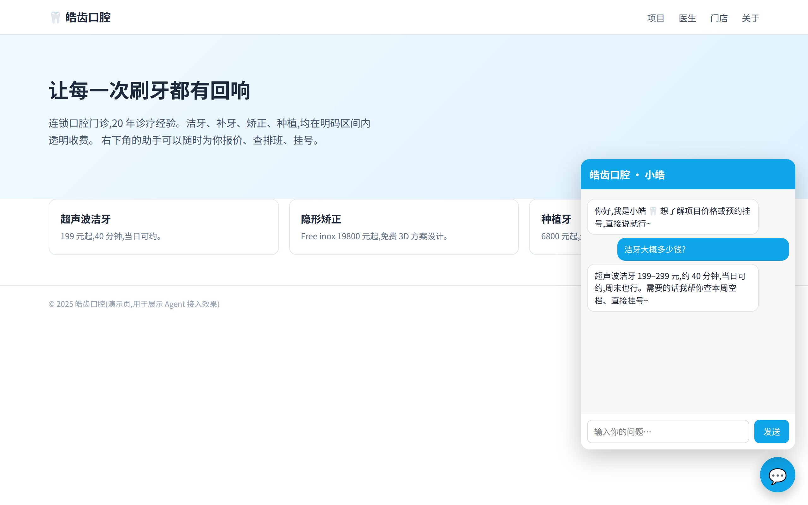

# mini-harness




> **EN** — A ~1k-line minimal AI agent harness for embedding into vertical/industry
> websites. One `<script>` tag mounts a Shadow-DOM chat widget; one `sites/*.site.mjs`
> file verticalizes identity / guardrails / tools / theme — the kernel never changes.
> OpenAI-compatible LLM, SSE streaming, token auth, rate limit, deploy kit included.

一个不到 1000 行(不含测试)的最小可行 Agent,专门为**垂直网站接入**而生:内核 = 5 个缝 + 1 个循环,插件只认识缝。**访客形态(网站嵌入)是产品形态**;另附一个终端 CLI 形态用于调试与内核冒烟。两者共用同一个内核,差别只是装了哪几个插件。

> 范围标尺见 [`docs/PURPOSE.md`](docs/PURPOSE.md):目的、非目标、决策三问。

## 两种形态

| | 调试形态(CLI) | 访客形态(网站接入,产品形态) |
|---|---|---|
| 入口 | `cli.mjs`(终端 REPL) | `server.mjs` + 一行 `<script>` |
| 工具 | bash 一个打天下 | **站点包白名单**(绝不暴露 bash) |
| 垂直化 | 改 prompt 插件 | **每站点一个 `.site.mjs` 插件包** |
| 会话 | store.json 落盘 | 每访客独立 messages(内存)+ 站点数据(store 缝落盘) |

## 目录

    kernel.mjs                  内核:事件总线/注册表/prompt 组装/agent 循环(与形态无关)
    plugins/llm.mjs             缝1 LLM 网关(OpenAI 兼容+重试)   ← DSH: host/apiproxy
    plugins/tools-bash.mjs      缝2 工具(开发者形态)            ← DSH: subprocess
    plugins/prompt.mjs          缝3 prompt 分段                  ← DSH: core/system-prompt
    plugins/store-json.mjs      缝4 JSON KV(原子写)             ← DSH: storage/storage-json
    server.mjs                  网站挂载层:多站点、每站点一内核、SSE 端点
    public/embed.js             一行 <script> 接入的聊天窗(Shadow DOM 隔离)
    public/demo.html            宿主页示例(口腔诊所官网)
    sites/demo-clinic.site.mjs  ★ 垂直站点包示例(口腔诊所:咨询+挂号)
    sites/demo-shop.site.mjs    ★ 垂直站点包示例(电商:查库存+下单)
    deploy/                     部署包:Dockerfile / fly.toml / nginx.conf / systemd / 示例客户页
    sites/README.md             站点包协议说明
    cli.mjs                     调试/冒烟形态(终端 REPL;非发布形态)
    docs/PURPOSE.md             项目章程:目的、非目标、决策三问(范围标尺)
    test.mjs                    内核 + 冒烟(无需 API key)
    test-web.mjs                访客形态端到端(mock LLM,走真实 HTTP/SSE)
    test-browser.mjs            真 Chrome E2E:跨域加载/Shadow DOM/打字机

## 网站接入(三步)

1. **起服务**(共享一个,也可按客户独立部署):

       MINI_LLM_API_KEY=sk-xxx node server.mjs
       # 或调试单站点:SITE=demo-clinic PORT=8787 node server.mjs

2. **宿主页加一行**(见 public/demo.html 底部):

       <script src="http://localhost:8787/embed.js" data-site="demo-clinic" defer></script>

3. **写垂直插件包**:新建 `sites/acme.site.mjs`(照抄 demo-clinic),四件事全在一个文件里:

```js
export default async function install(ctx, env) {
  // 1. 身份与规则 → 缝3
  ctx.prompt.register({ id: 'identity', priority: 0, text: '你是 Acme 官网助手…' });

  // 2. 垂直工具 → 缝2(访客能用什么,白名单说了算)
  ctx.tools.register({
    id: 'query_stock',
    description: '查询商品库存',
    parameters: { type: 'object', properties: { sku: { type: 'string' } }, required: ['sku'] },
    async execute({ sku }) { return db.lookup(sku); },          // 任意 JS,接你现有系统
  });

  // 3. 兜底/守门 → 事件缝
  ctx.on('before:chat', (p) => { /* p.reject = '不聊这个'; */ });
  ctx.on('after:final', (p) => { /* 空回复替换成转人工话术 */ });

  // 4. 前端呈现
  ctx.embed = { title: 'Acme 助手', welcome: '你好~', theme: { accent: '#16a34a' } };
}
```

内核与 server 零改动。工具 `execute` 里就是普通 JS,可以直接调客户现有的
HTTP API / 数据库 / CRM——这就是"想怎么垂直就怎么垂直"。

## 站点包协议(钩子总览)

| 钩子 | 时机 | 典型用途 |
|---|---|---|
| `ctx.prompt.register` | 装载时 | 行业身份、话术规则 |
| `ctx.tools.register` | 装载时 | 报价/库存/预约/查单…… |
| `ctx.on('before:chat')` | 每条消息前 | 守门、改写(p.reject 直接拒绝) |
| `ctx.on('after:final')` | 回复后 | 兜底话术、合规过滤(改 `out.content`) |
| `ctx.store` | 任意 | 预约单、订单、表单落盘(重启可恢复) |
| `ctx.embed` | 装载时 | 标题/欢迎语/主题色/`allowedOrigins` 白名单 |

端点:`GET /embed.js`、`GET /s/:site/embed.json`、`POST /s/:site/api/chat`(SSE:`delta` 逐段 → `reset` 工具轮前清屏 → `final` 收尾)、`GET /healthz`。

内置防护:OPTIONS 预检 + CORS、embed token 鉴权(401)、每 IP+会话令牌桶限流(429)、
消息校验、失败轮回滚、会话 TTL/LRU 与落盘恢复、客户端断连即中止 LLM。

## 部署到公网

见 [`deploy/README.md`](deploy/README.md):Fly.io / Docker / systemd+nginx 三种,都是改一行 host。
接入客户网站就一行(部署后 token 写进 `data/<site>/config.json`,不进仓库):

    <script src="https://your-host/embed.js" data-site="demo-clinic" data-token="sek-..." defer></script>

> `data-token` 在页面源码里可见(同 Google Maps key 的固有限制);防刷靠
> **token + 限流 + Origin 白名单**三层组合,别把它当密钥。

## 测试

    node test.mjs            # 内核 + 冒烟(不需要 API key)
    node test-web.mjs        # 访客形态 14 项:流式/CORS/限流/双站点包/回滚/重启恢复(全 mock)
    node test-browser.mjs    # 真 Chrome:跨域加载/Shadow DOM/打字机逐字(需先 npm install)

## 对应到 deepseek-harness

内核缝与 DSH 的映射不变(llm↔apiproxy、tools↔subprocess、prompt↔system-prompt、
store↔storage-json、events↔cordis)。**站点包 = DSH 的 `agent-presets` 思想**
(按会话组合插件)搬到网站场景:每站点一个 cordis.yml 式的组合文件,只是这里
组合物是 20 行 JS 而不是一整套 UI。

## 生产化还差什么(已内置 CORS/限流/流式/持久化/token 鉴权/浏览器 E2E)

- 真模型流式实测:`llm.mjs` 的 SSE delta 拼装只跑过 mock,需真实 key 环境
- 多副本部署:会话换 Redis/Postgres(改 `ctx.sessions` 一个对象即可)
- 密钥隔离:大客户独立进程 + 独立 `MINI_LLM_API_KEY`
- 观测:接入 OpenTelemetry(事件缝上挂 exporter 即可)
